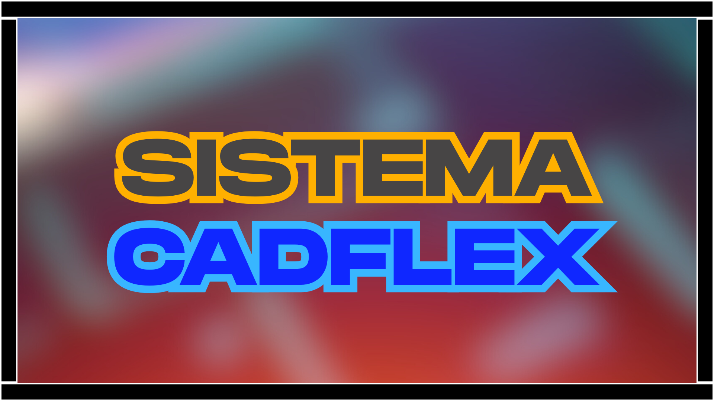

  

<h1 align="center">🛒 CadFlex – Sistema de Cadastro de Produtos 📦</h1>

  <strong>Projeto acadêmico desenvolvido em Java com Programação Orientada a Objetos (POO)</strong> 
  <strong>💻 Interface gráfica com Swing + MVC + Banco de Dados + DAO + Splash screen</strong>

---

## 📘 Descrição do Projeto

O **CadFlex** é um sistema de cadastro de produtos físicos e digitais que permite operações como inclusão, alteração, exclusão e visualização de produtos. Utiliza conceitos modernos de Programação Orientada a Objetos (POO), arquitetura MVC, e persistência de dados com MySQL. O sistema apresenta interface gráfica intuitiva construída com Swing, suporte a imagens e até tela de introdução com vídeo (.mp4).

---

## 🚀 Funcionalidades

### 🔐 Login de Acesso
- Validação de email e senha direto no banco de dados.
- Verificação de credenciais e redirecionamento para o menu principal.

### 🧾 Cadastro de Produtos
- Cadastro de produto físico com peso (em kg).
- Cadastro de produto digital com chave de ativação.
- Validação de campos, tipos e valores.
- Interface amigável com botões, imagens e janelas modais.

### ✏️ Alterar Produto
- Busca por ID do produto.
- Atualização de dados com verificação e retorno visual.
  
### ❌ Excluir Produto
- Exclusão de produto com ID.
- Confirmações de segurança.

### 📋 Visualizar Produtos
- Exibição de todos os produtos cadastrados.
- Lista organizada por ID, nome, tipo e valor.

---

## 🛠️ Tecnologias Utilizadas

- **Linguagem:** Java 17+
- **GUI:** Java Swing
- **Banco de Dados:** MySQL 8+ (via JDBC)
- **Padrões:** MVC, DAO, Herança e Polimorfismo
- **Extras:** Vídeo de abertura `.mp4`, imagens `.png`, telas personalizadas `.form`

  
  

---

## 🧩 Estrutura de Classes

- **Model:**
  - `Produto` (classe abstrata)
  - `ProdutoFisico` e `ProdutoDigital` (herdam de Produto)
  - `ProdutoDAO` (operações CRUD com JDBC)

- **View:**
  - `Login.java`, `MenuPrincipal.java`, `IncluirView.java`, `AlterarView.java`, `ExcluirView.java`, `VerCadastrosView.java`, `CreditosView.java`, `TelaRecomendacoesView.java`, `SplashScreen.java`

- **Controller:**
  - `ProdutoController.java` (camada de controle das ações)

---

## 🗃️ Banco de Dados

- **Tabelas**:
  - `produto` – Armazena dados comuns.
  - `produto_fisico` – Contém produtos com peso (com FK para produto).
  - `produto_digital` – Contém produtos com chave (com FK para produto).

- **Regras de Integridade**:
  - ID é chave primária e auto-incrementada.
  - Um produto só pode ser de um tipo.
  - Operações sincronizadas com DAO.

---

## 🎨 Interface Gráfica

- Telas com imagens de fundo (.png)
- Botões estilizados e centralizados
- Tela de introdução com vídeo (`intro.mp4`)
- Navegação entre telas com eventos

---

## 👨‍💻 Autoria

- **Desenvolvedor:** Vitor Manoel Vidal Braz  
- **Curso:** Sistemas de Informação - UNIVALE  
- **Período:** 3º  
- **Disciplina:** Programação Orientada a Objetos (POO)  
- **Professor Orientador:** Vitor Silva Ribeiro

---

## 🔗 Repositório

- 🔗 GitHub: [@vitormanoelvb](https://github.com/vitormanoelvb)
- 📁 Projeto no GitHub: [CadFlex - Sistema de Cadastro de Produtos](https://github.com/vitormanoelvb/sistemacadastro-CadFlex)

---

## 📺 Créditos Visuais

🖥️ *Projeto com identidade visual VM ENGINE DEVELOPMENT v1.5*

  

---

## ⚠️ Observações

> Este sistema tem fins acadêmicos e foi desenvolvido para aprendizado prático de Java, JDBC, MVC e POO. Não recomendado para uso em produção sem ajustes de segurança e escalabilidade.

---

  

